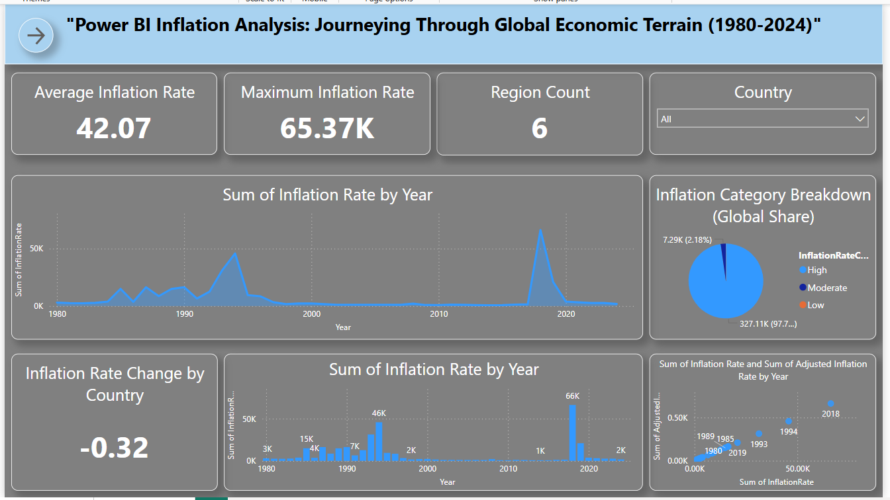
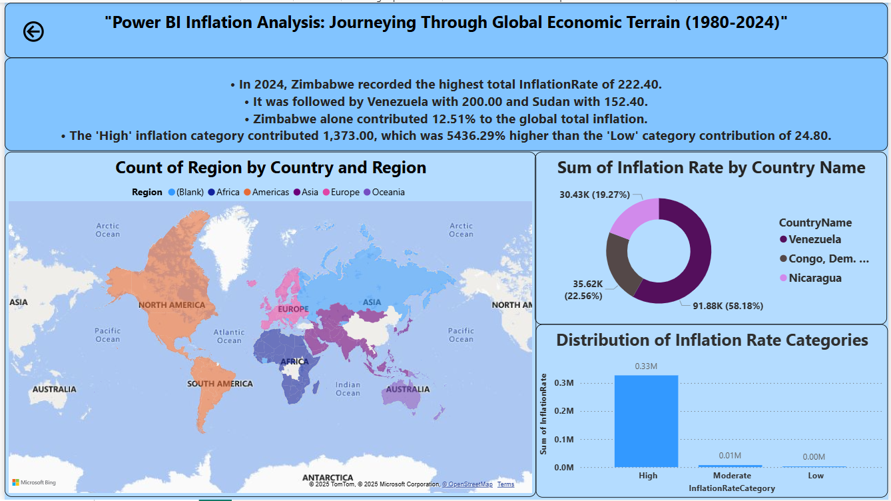

<div align="center">

<h1>🌍 Global Inflation Analysis – Power BI Dashboard (1980–2024)</h1>
<p><i>An interactive visual story of global inflation dynamics, built with DAX, precision, and purpose.</i></p>

<div>
  
  
  
  
  
</div>

<p><b>By Siddharth Chauhan | CSE ‘26 | Data Analyst in Progress</b></p>

</div>

---

## 📘 Project Overview

This is my Power BI dashboard project focused on analyzing global inflation from **1980 to 2024** across countries and regions.

I originally developed it as part of a virtual internship with **SmartBridge**, but I’ve since rebuilt it from scratch to reflect what I’d deliver in a **real analytics job** — complete with optimized visuals, DAX-driven KPIs, region-based insights, and storytelling.

Through this dashboard, I aim to answer:  
> *Where is inflation rising fastest? Which regions contribute most? What do the trends reveal globally?*

---

## 💡 Key Highlights

- 🔢 **Dynamic KPIs**: Average, maximum, and delta inflation rate
- 🎯 **Slicers & Filters**: Focus insights by country
- 📈 **Line & Column Charts**: Trends and category breakdowns
- 🗺 **Map**: Inflation visualized by region
- 🍩 **Donut Chart**: Top 3 inflation contributors
- 🧠 **Smart Narrative**: Auto-generated insight summary via DAX
- 🧱 **Pixel-perfect Grid**: Designed for clarity, alignment, and executive presentation

## 📁 File Structure

```bash
Inflation-Analysis-PowerBI/
│
├── InflationAnalysis_SiddharthChauhan.pbix        # Power BI project file
│
├── datasets/
│   ├── global_inflation_data.csv
│   └── continents.csv
│
├── assets/
│   ├── dashboard_page1.png
│   ├── report_page2.png
│   └── preview.gif                                 # (optional)
│
├── docs/
│   ├── InflationAnalysis_SiddharthChauhan.pdf      # Final report (PDF)
│   └── ProjectDocumentation.pdf                    # Step-by-step explanation
│
├── README.md                                       # Project overview and instructions
└── LICENSE                                         # MIT License

```
---

## 🖥️ Dashboard Pages

### 📊 Page 1: Dashboard  
- KPI Cards (Avg, Max, Region Count)  
- Year-wise trend line (Inflation Rate)  
- Pie chart: Inflation Categories (High / Moderate / Low)  
- Country-wise comparison: Column + Scatter chart  

### 📍 Page 2: Report  
- Donut: Top 3 inflation contributors (latest year)  
- Region map (from joined dataset)  
- Smart DAX narrative: Country + category gap summary  
- Category bar chart comparison  

| Dashboard Overview | Report & Insights |
|--------------------|-------------------|
|  |  |

---

## 🧰 Tech Stack

| Tool        | Purpose                        |
|-------------|--------------------------------|
| Power BI    | Visual design & dashboard build |
| Power Query | Data cleanup & transformation |
| DAX         | Measures, logic & KPIs        |
| CSV         | Source data files             |
| GitHub      | Project documentation & versioning |

---

## 🎥 Project Demonstration

> ▶ **[Click here to watch the full walkthrough]()**  
> 

---
---

## 🧾 Documentation

- 🔍 **Project Steps & Decisions**: [`ProjectDocumentation.pdf`](docs/ProjectDocumentation.pdf)  
- 📝 **Exported Report (PDF)**: [`InflationAnalysis_SiddharthChauhan.pdf`](docs/InflationAnalysis_SiddharthChauhan.pdf)

---

## 👤 About Me

Hi, I’m **Siddharth Chauhan** – an aspiring data analyst who believes data deserves design, and dashboards should tell stories. I'm currently pursuing B.Tech in Computer Science (Class of ‘26) and building real-world portfolio projects in Power BI, Excel, Python, and SQL.

🔗 [LinkedIn](https://www.linkedin.com/in/thesiddemigod/)  
📩 Always open to internships, remote projects, and data storytelling roles.

---

## 🔖 License

Released under the **MIT License** – feel free to fork, remix, or learn from it (with credit).

---

> **This isn’t content. It’s canon.** 🔥
