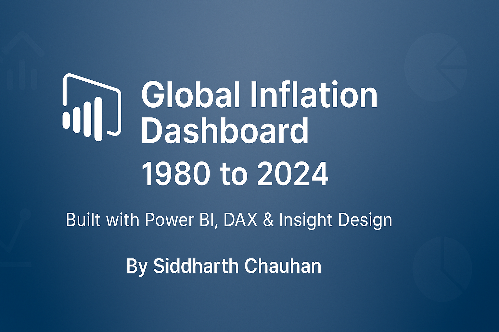

<div align="center">

<h1>🌍 Global Inflation Analysis – Power BI Dashboard (1980–2024)</h1>
<p><i>An interactive visual story of global inflation dynamics, built with DAX, precision, and purpose.</i></p>

<div>
  
  
  
  
  
</div>

<p><b>By Siddharth Chauhan | CSE ‘26 | Data Analyst in Progress</b></p>

</div>

---

## 📘 Project Overview

This is my Power BI dashboard project focused on analyzing global inflation from **1980 to 2024** across countries and regions.

I originally developed it as part of a virtual internship with **TheSmartBridge**, but I’ve since rebuilt it from scratch to reflect what I’d deliver in a **real-world data analytics role** — complete with optimized visuals, DAX-driven KPIs, region-based insights, and storytelling.

Through this dashboard, I aim to answer:  
> *Where is inflation rising fastest? Which regions contribute most? What do the trends reveal globally?*

---

## 💡 Key Highlights

- 🔢 **Dynamic KPIs**: Average, maximum, and delta inflation rate
- 🎯 **Slicers & Filters**: Focus insights by country
- 📈 **Line & Column Charts**: Trends and category breakdowns
- 🗺 **Map**: Inflation visualized by region
- 🍩 **Donut Chart**: Top 3 inflation contributors
- 🧠 **Smart Narrative**: Auto-generated insight summary via DAX
- 🧱 **Pixel-perfect Grid**: Designed for clarity, alignment, and executive presentation

## 📁 File Structure

```bash
Inflation-Analysis-PowerBI/
|
├── assets/                      # All visuals, screenshots, and thumbnails
│   ├── adjusted_inflation_rate.png
│   ├── bar_chart_high_vs_low_sum_of_inflation.png
│   ├── column_chart_annual_sum_of_inflation_rate.png
│   ├── customer_problem_statement_template1.png
│   ├── customer_problem_statement_template2.png
│   ├── dashboard_page1.png
│   ├── donut_chart_top_3_countries_latest_year.png
│   ├── filled_map_chart_region_country_mapping.png
│   ├── filter_country_germany.png
│   ├── filter_country_india.png
│   ├── inflation_rate_category.png
│   ├── inflation_rate_change.png
│   ├── inflation_summary1.png
│   ├── inflation_summary2.png
│   ├── inflation_summary3.png
│   ├── jira_project_planning_template.png
│   ├── kpi_cards_average_maximum_region_count.png
│   ├── line_chart_sum_of_inflation_rate_over_years.png
│   ├── pie_chart_category_share_breakdown.png
│   ├── preview.png
│   ├── report_page2.png
│   ├── scatter_plot_inflation_vs_adjusted_inflation.png
│   ├── thumbnail_global_inflation_dashboard.png
│   └── thumbnail_global_inflation_dashboard_v2.png
│
├── datasets/                   # Data files used in the project
│   ├── continents.csv
│   └── global_inflation_data.csv
│
├── docs/                       # Project documentation templates
│   ├── 01_project_initialization_and_planning_phase/
│   │   ├── DefineProblemStatements_Template.pdf
│   │   ├── ProjectPlanning_Template.pdf
│   │   └── ProjectProposal_ProposedSolution_Template.pdf
│   │
│   ├── 02_data_collection_and_preprocessing_phase/
│   │   ├── DataExplorationAndPreprocessing_Template.pdf
│   │   ├── DataQualityReport_Template.pdf
│   │   └── RawDataSourcesIdentificationReport_Template.pdf
│   │
│   ├── 03_data_visualization/
│   │   └── BusinessQuestionAndVisualisationReport_Template.pdf
│   │
│   ├── 04_dashboard/
│   │   └── DashboardDesign_Template.pdf
│   │
│   ├── 05_report/
│   │   └── ReportDesign_Template.pdf
│   │
│   ├── InflationAnalysis_SiddharthChauhan.pdf
│   └── ProjectDocumentation.pdf
│
├── InflationAnalysis_SiddharthChauhan.pbix        # Power BI project file
├── README.md                                       # Project overview and instructions
└── LICENSE                                         # MIT License

```
---

## 🖥️ Dashboard Pages

### 📊 Page 1: Dashboard  
- KPI Cards (Avg, Max, Region Count)  
- Year-wise trend line (Inflation Rate)  
- Pie chart: Inflation Categories (High / Moderate / Low)  
- Country-wise comparison: Column + Scatter chart  

### 📍 Page 2: Report  
- Donut: Top 3 inflation contributors (latest year)  
- Region map (from joined dataset)  
- Smart DAX narrative: Country + category gap summary  
- Category bar chart comparison  

| Dashboard Overview | Report & Insights |
|--------------------|-------------------|
|  |  |

---

## 🧰 Tech Stack

| Tool        | Purpose                        |
|-------------|--------------------------------|
| Power BI    | Visual design & dashboard build |
| Power Query | Data cleanup & transformation |
| DAX         | Measures, logic & KPIs        |
| CSV         | Source data files             |
| GitHub      | Project documentation & versioning |

---

## 🎥 Project Demonstration

>▶ **Click the image below to watch the full walkthrough**
>
> <a href="https://drive.google.com/file/d/1nVgGonZak2qYz1hfpl8U4IKuwlz2hioa/view?usp=sharing">
>   
> </a>

---
---

## 🧾 Documentation

- 🔍 **Project Steps & Decisions**: [`ProjectDocumentation.pdf`](docs/ProjectDocumentation.pdf)  
- 📝 **Exported Report (PDF)**: [`InflationAnalysis_SiddharthChauhan.pdf`](docs/InflationAnalysis_SiddharthChauhan.pdf)
- 📅 **All Internship Templates** (Phase-wise): see [`/docs`](docs/) subfolders for detailed PDF templates across 5 modules.

---

## 👤 About Me

Hi, I’m **Siddharth Chauhan** – a data analyst-in-training who believes data deserves design, and dashboards should tell stories. I'm currently pursuing B.Tech in Computer Science (Class of ‘26) and building real-world portfolio projects in Power BI, Excel, Python, and SQL.

🔗 [LinkedIn](https://www.linkedin.com/in/thesiddemigod/)  
📩 Always open to internships, remote projects, and data storytelling roles.

---

## 🔖 License

Released under the **MIT License** – feel free to fork, remix, or learn from it (with credit).

---

> **This isn’t content. It’s canon.** 🔥
