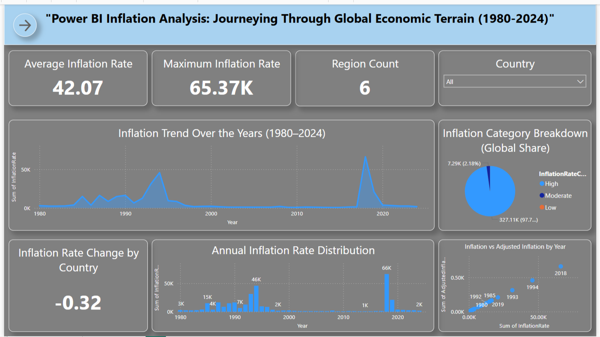
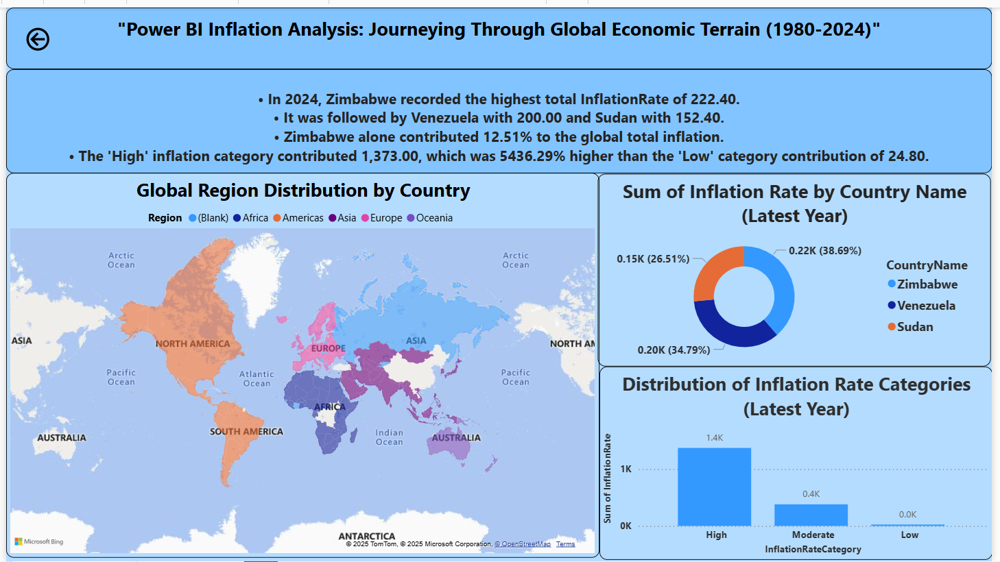

  
  <h1>🌍 Global Inflation Analysis – Power BI Dashboard (1980–2024)</h1>
  
<i>Visualizing macroeconomic inflation trends across countries and regions with interactive Power BI storytelling.</i>

  

    
    
    
    
  

  
Created by Siddharth Chauhan | CSE '26 | Data Analyst in Progress

---

## 📘 Project Overview

This Power BI dashboard analyzes global inflation patterns across countries and regions from **1980 to 2024**. Originally built during a virtual internship with **SmartBridge**, this project is restructured as a **portfolio-quality data analytics case study** with refined DAX, design, and insight communication.

Users can explore:
- Year-wise inflation rate shifts
- Regional distribution of inflation
- Top inflation-contributing countries
- Inflation category segmentation (High / Moderate / Low)

---

## 🧠 Key Highlights

- 🔢 **Dynamic DAX KPIs**: Avg, Max, Δ Inflation Rate by Country
- 📆 **Interactive Filtering**: Country slicers, year-specific views
- 🗺 **Region Map**: Geographic visualization by continent
- 🍩 **Donut Chart**: Top 3 inflation contributors (latest year)
- 📋 **Narrative Summary**: Smart multi-line DAX-based insight card
- 🖥 **Responsive Design**: Clean grid alignment, job-ready layout

---

## 📁 Repository Structure

Inflation-Analysis-PowerBI/
│
├── InflationAnalysis_SiddharthChauhan.pbix # Main Power BI file
│
├── datasets/
│ ├── global_inflation_data.csv
│ └── continents.csv
│
├── assets/
│ ├── dashboard_page1.png
│ ├── report_page2.png
│ └── preview.gif # (optional)
│
├── docs/
│ ├── InflationAnalysis_SiddharthChauhan.pdf # Exported PDF
│ └── ProjectDocumentation.md # Full project build steps
│
└── README.md

---

## 📸 Dashboards

### 📊 Page 1: Dashboard  
- Cards for KPI summary (Average, Max, Count)
- Line chart: Inflation trend over years
- Pie chart: Category-wise inflation split
- Column + Scatter: Inflation distributions

### 📍 Page 2: Report  
- Donut chart: Top 3 countries (latest year)
- Region map: Country → Region
- Dynamic narrative summary (DAX)
- Bar chart: Category comparison

| Dashboard | Report Page |
|-----------|-------------|
|  |  |

---

## 🛠 Tools & Tech

| Tool        | Use Case                      |
|-------------|-------------------------------|
| Power BI    | Data modeling & visualization |
| DAX         | Dynamic calculations          |
| Power Query | Data prep & transformation    |
| CSV         | Raw dataset files             |
| GitHub      | Portfolio publishing          |

---

## 📽️ Project Demonstration

> ▶️ [Watch the video walkthrough](https://your-demo-video-link.com)  
> *(Optional preview below)*  
> 

---

## 🧾 Documentation

- Step-by-step development: [`docs/ProjectDocumentation.md`](docs/ProjectDocumentation.md)
- Final PDF export for presentation: [`docs/InflationAnalysis_SiddharthChauhan.pdf`](docs/InflationAnalysis_SiddharthChauhan.pdf)

---

## 👤 About Me

**Siddharth Chauhan**  
🎓 B.Tech CSE '26 | Power BI & Data Analytics  
🔗 [LinkedIn Profile](https://www.linkedin.com/in/siddharth-chauhan-0a4b7a209/)  
📩 Open to internships, freelance, and data roles

---

## 🔖 License

Released under the **MIT License** – use, fork, and learn with credit.  
Let the data speak, the dashboard deliver, and the story inspire.

---

> “This isn’t content. It’s canon.” 🔥  
